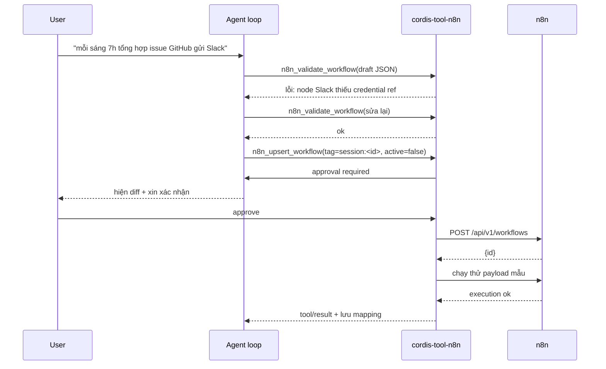

# Cordis Agent Core — Tài liệu kiến trúc

> Fork từ `deepseek-ai/deepseek-harness` (dsh), giữ nguyên core, mở rộng bằng plugin.
> **Single-user. Một artifact. Một process. Plugin cố định lúc build.**
> Surface: Next.js + shadcn tự build, đóng gói vào cùng core.
> Tích hợp: n8n nhận automation do Agent sinh ra.

Phiên bản: v0.3 — thay thế v0.2 (bản còn plugin manager + store).

---

## 0. Phạm vi

| Hạng mục | Quyết định |
|---|---|
| Tenancy | **Single-user.** Không có user/tenant trong core. |
| Đóng gói | **Một image, một process, một lệnh chạy.** FE build ra static, core serve. |
| Plugin | **Cố định trong profile lúc build.** Không store, không cài runtime, không toggle on/off. |
| Đổi hành vi | Sửa `cordis.patch.yml` → restart (§5). Đổi code plugin → rebuild. |
| Auth | Mặc định không có (bind `127.0.0.1`). Passphrase khi chạy trên VM. |
| Datastore | **Không DB.** Session log native trong `DSH_HOME`. |
| Automation | n8n chạy cạnh — service duy nhất thứ hai. |
| Upgrade dsh | Merge `upstream/master`; zero patch vào `packages/`. |

**Đã bỏ qua ba vòng thu hẹp:** BFF riêng, JWT nội bộ, authorization theo scope, MariaDB, Redis, S3/MinIO, đường multi-instance (v0.1) → plugin store, plugin manager runtime, `plugins.json` desired-state (v0.3).

Vòng cuối này bỏ được nhiều hơn vẻ ngoài của nó. Mất theo plugin manager: registry fork handle, kiểm tra dependency và reverse-dependency, thứ tự topo lúc boot, trạng thái `degraded` khi dispose lỗi, và bug tool-schema đổi giữa turn đang chạy. Mất theo store: manifest validation, resolve version, và **rủi ro lớn nhất còn sót của v0.2 — cài plugin là chạy code tuỳ ý trong process core**. Giờ mọi dòng code chạy trong core đều đi qua git của bạn.

---

## 1. Nền tảng dsh — ba điều quyết định thiết kế

**1. Không có "core" để vá.** Cordis là framework bên dưới dsh: plugin đóng góp service, typed event và *reversible effect* vào một context chung. Model adapter, tool registry, session log, kể cả agent loop — tất cả đều là plugin, đều thay được từ config. Mở rộng đúng cách là mount plugin bên cạnh, không sửa code gốc.

Bỏ toggle runtime **không** làm mất điểm này. "Everything is a plugin" vẫn là cách bạn thêm năng lực: viết plugin, thêm row vào profile. Chỉ khác là composition chốt lúc boot thay vì đổi lúc chạy — và với một process khởi động vài giây thì khác biệt đó gần bằng không.

**2. Cây plugin compose lúc boot theo lớp.**

```
dsh-base  →  bundle kế tiếp  →  profile/cordis.patch.yml  →  home cordis.patch.yml  →  --patch overlay
```

- **Bundle** = định dạng phân phối config row + code chúng mount. Khai báo ở `package.json` field `dsh.bundle`.
- **Profile** = composition có tên, liệt kê bundle nó stack, giữ plugin out-of-tree và `cordis.patch.yml` riêng. Field `dsh.profile`.
- Patch nhắm row theo `id`, thay **toàn bộ** config row đó, hoặc chèn row mới.

```bash
dsh --profile cordis-app --dump-config   # row nào in ra là row đó patch được
```

**3. Effect tự unwind khi plugin unload.** Vẫn còn giá trị dù không toggle: nó đảm bảo shutdown sạch, và test plugin bằng mount/dispose trong vitest không rò state giữa các case.

### 1.1 Seam sẽ dùng

| Gói | Sở hữu | `ctx` key |
|---|---|---|
| `core/session` | Log `SessionEvent` append-only + store in-memory | `ctx.sessions` |
| `core/system-prompt` | Ráp prompt section + tool schema | `ctx.systemPrompt` |
| `core/tools` | Tool registry có scope + pipeline có guard | `ctx.tools` |
| `core/agent` | Interface `Agent`, live registry, event `agent/*` | `ctx.agents` |
| `core/agent-loop` | Driver mặc định | `ctx.agentLoop` |
| `llm/llm` | Vocabulary message/stream + adapter seam | `ctx.llm` |

Thêm: `ctx.commands` (lệnh người, không tốn model turn), `ctx.jobs`, `ctx.fs`, `ctx.shell`, `ctx.subprocess`, `ctx.sandbox`, `ctx.terminals`, `ctx.goals`, `ctx.sessionTitle`.

### 1.2 Bảng tra: muốn làm X thì gắn vào đâu

| Mục tiêu | Cơ chế |
|---|---|
| Thêm model provider | Đăng ký adapter lên `ctx.llm` |
| Thêm capability cho model | Đăng ký lên `ctx.tools`; schema tự vào prompt assembly |
| Thêm lệnh của người | Đăng ký lên `ctx.commands` |
| Thêm việc chạy nền | Đăng ký lên `ctx.jobs`; tool `job_*` thu/stop |
| Chặn request/tool/turn | Event `agent/*` hoặc `tools/*`; `agent/turn-stopping` dừng turn |
| Bơm context cho model | `agent.inject()` — vào request kế tiếp được admit |
| UI ngoài | Drive `ctx.agents`, render từ `session/event` |
| State bền của session | Mở rộng `SessionEventMap`, render + replay từ log |

### 1.3 Luật bất biến

> **Model-visible means logged.** Thứ gì tới được model request phải tái dựng được từ session log; có runtime invariant assert điều này.

Hệ quả: input từ n8n hay webhook **không** được nhét thẳng vào prompt. Muốn model thấy → thêm session event mới rồi render từ log. Vi phạm là hỏng replay, fork, transcript, telemetry cùng lúc.

---

## 2. Đóng gói: một core duy nhất

### 2.1 Hình dạng

```
┌──────────────────────────────────────────────┐
│  cordis-core  — 1 image, 1 process           │
│  $ dsh --profile cordis-app                  │
│                                              │
│  webserver row (mượn từ dsh-web-app)         │
│   ├── cordis-ui      → serve Next static dist│
│   └── cordis-gateway → REST + SSE            │
│  dsh-base: agent-loop · tools · session ·    │
│            sandbox · approval · credentials  │
│  cordis-llm-openai-compat                    │
│  cordis-tool-n8n                             │
│  cordis-audit                                │
└──────────────────────────────────────────────┘
        │ REST /api/v1  (same origin, không CORS)
        ▼
   n8n  (service thứ hai, service cuối cùng)
```

### 2.2 Next.js build ra static, core serve

FE dùng `output: 'export'` → ra thư mục `dist`. Plugin `cordis-ui` resolve đường dẫn dist và mount làm static owner — đúng pattern upstream dùng cho frontend của họ. Không có Node server thứ hai.

```js
// apps/web/next.config.mjs
export default {
  output: 'export',
  images: { unoptimized: true },
}
```

**Được:** một process, một port, một chỗ log, một chỗ crash. FE và API cùng origin → không CORS, không proxy, không JWT nội bộ.

**Mất — nói thẳng:** không còn RSC, server-side fetching, Next middleware, Auth.js route handler. FE thành SPA thuần, mọi dữ liệu qua `fetch`. Với tool cá nhân chạy localhost thì ba cái này không mất gì thật. Nhưng phải quyết từ đầu — để muộn là FE lỡ tay dùng route handler rồi gỡ rất đau.

### 2.3 Auth cho single-user

Không có user system. Chỉ có câu hỏi "ai chạm được port này".

| Kịch bản | Cách làm |
|---|---|
| Chạy local | Bind `127.0.0.1`, không auth. Đúng cách upstream mặc định chạy. |
| Chạy trên VM riêng | `cordis-gateway` bật passphrase: `POST /api/v1/unlock` → cookie httpOnly ký bằng secret trong `DSH_HOME`. Middleware chặn route khác. ~80 dòng, không cần thư viện auth. |
| Truy cập từ xa | Tailscale hoặc SSH tunnel, hơn là publish port + TLS. Ít thứ phải maintain hơn. |

CLI của dsh cố tình **từ chối `--host 0.0.0.0`** — nó không hỗ trợ bind mọi interface. Đừng patch để lách; dùng tunnel.

---

## 3. Tech stack

### 3.1 Frontend — `apps/web`

| Thành phần | Lựa chọn | Ghi chú |
|---|---|---|
| Framework | Next.js 15, `output: 'export'`, TS strict | SPA, không server runtime |
| UI | shadcn/ui + Tailwind v4 + Radix | Đã chốt |
| State server | TanStack Query v5 | Cache/retry/invalidation cho REST |
| State client | Zustand | Stream đang chạy, composer, panel |
| Realtime | **SSE** | Luồng chủ yếu 1 chiều core→FE; reconnect bằng `Last-Event-ID` |
| Form | react-hook-form + zod | Form settings, credential |
| Markdown/code | react-markdown + shiki | Assistant message, diff, code block |

**Route (client-side)**

```
/                       → redirect session gần nhất
/chat/[sessionId]       → conversation + tool timeline
/automations            → workflow n8n do agent sinh
/settings/{models,credentials,sandbox}
```

Không còn `/plugins`, không còn `/plugins/store`.

**Render hội thoại.** dsh giữ nguyên `assistant/chunk` thô để replay và giữ fidelity UI. Dựng lại conversation từ chuỗi event, mỗi loại event map sang một node renderer có key — đúng mô hình `ConversationNodeDefinition` của upstream. Giữ đúng thì mỗi tool mới chỉ cần thêm một renderer.

### 3.2 Core — `cordis-core`

| Thành phần | Lựa chọn |
|---|---|
| Base | Fork dsh, Node.js LTS, pnpm workspace |
| Composition | Profile `cordis-app` stack trên `dsh-base` |
| Mượn từ `dsh-web-app` | Webserver row, workspace row, projection cache row |
| Bỏ của `dsh-web-app` | Browser plugin roster, frontend dist, client HMR chain |
| Build | tsdown (như upstream), test vitest |

**Layout fork — quy tắc sống còn để upgrade được**

```
cordis/
├── packages/                   # ★ NGUYÊN BẢN upstream, không sửa 1 dòng
├── x-packages/                 # ★ toàn bộ code của bạn
│   ├── profile/cordis-app/     # package.json { dsh.profile }
│   ├── bundle/cordis-app/      # package.json { dsh.bundle } + cordis.patch.yml
│   └── plugin/{ui,gateway,llm-openai-compat,tool-n8n,audit}/
├── apps/web/                   # Next.js → static dist
└── deploy/                     # Dockerfile, compose
```

Đổi hành vi row upstream → patch trong `x-packages/bundle/cordis-app/cordis.patch.yml`. Không sửa `packages/`. Upgrade = `git merge upstream/master`, conflict chỉ ở lockfile.

### 3.3 Lưu trữ

**Không database.**

| Dữ liệu | Nằm ở đâu |
|---|---|
| Session log (nguồn sự thật) | `DSH_HOME` — persistence của `dsh-base`, append-only |
| Config runtime | `DSH_HOME/cordis.patch.yml` (§5) |
| Credential | Credential service của `dsh-base` |
| File agent đụng tới | Volume `workspace` |
| Artifact / upload | `DSH_HOME/blobs/` |
| Mapping workflow n8n ↔ session | `DSH_HOME/automations.json` |
| n8n | Volume riêng, SQLite mặc định của n8n |

Với một người dùng, mốc mà list session chậm đến mức cần index nằm rất xa. Thêm SQLite sau nếu chạm tới, không thêm trước.

---

## 4. Năm plugin

Tất cả là plugin Cordis thuần, mount cố định trong bundle `cordis-app`.

### P1 — `cordis-ui`
Resolve Next static dist, mount static owner trên webserver row. Fail loud lúc activate nếu chưa build dist (upstream làm đúng vậy — có hint build, không fallback serve source). Kèm SPA fallback: path không khớp file → `index.html`.

### P2 — `cordis-gateway`
HTTP surface: REST + SSE (§6). Passphrase middleware nếu bật. Subscribe `session/event` đẩy ra SSE; mỗi event có sequence id để FE reconnect replay từ log, không mất chunk. Backpressure: client chậm thì drop `assistant/chunk` trung gian — chunk vẫn còn trong log.

### P3 — `cordis-llm-openai-compat`
Adapter lên `ctx.llm`, nói chuẩn OpenAI-compatible → dùng được DeepSeek, vLLM, OpenRouter, LM Studio, Ollama bằng một plugin. Config: base URL, model id, headers, giá token. Credential đọc từ credential service, **không** để trong config row.

### P4 — `cordis-tool-n8n`
Nhóm tool cho agent tạo/sửa/kích hoạt workflow. Xem §7.

### P5 — `cordis-audit`
Listener `tools/post-execute` + `telemetry/*`. Ghi audit line (tool nào, tham số, kết quả rút gọn, redact secret) vào `DSH_HOME/audit/*.jsonl`. Đếm token/cost mỗi step. Không cần OTLP cho một người — JSONL đọc bằng `jq` là đủ.

---

## 5. Đổi hành vi mà không viết code

Đây là thứ thay thế cho plugin toggle, và nó đủ dùng vì vòng lặp "sửa file → restart" chỉ mất vài giây.

**Bốn tầng patch, từ ngoài vào trong:**

| Tầng | Ở đâu | Đổi cần gì | Dùng khi |
|---|---|---|---|
| Bundle | `x-packages/bundle/cordis-app/cordis.patch.yml` | Rebuild image | Mặc định của sản phẩm |
| Profile | Profile trong `DSH_HOME` | Restart | Ít dùng, thường trùng tầng dưới |
| **Home** | `DSH_HOME/cordis.patch.yml` | **Chỉ restart container** | ★ Chỗ chỉnh chính hằng ngày |
| Overlay | `--patch file.yml` trên command line | Chỉ lần chạy đó | Thử nghiệm một lần, không muốn dính lại |

Vì `DSH_HOME` là volume mount, **tầng Home sửa được từ ngoài container mà không cần rebuild**. Đây là đường chỉnh chính:

```bash
vim ./data/harness/cordis.patch.yml     # tắt một tool row, đổi model, đổi sandbox policy
docker compose restart core             # ~vài giây
```

Patch nhắm row theo `id` và **thay toàn bộ config của row đó** — không merge từng field. Nên luôn chạy `--dump-config` lấy config hiện tại của row rồi sửa từ đó, đừng viết tay từ đầu.

**Muốn "tắt" một plugin?** Patch bỏ row của nó khỏi entry list, restart. Kết quả giống hệt toggle off, chỉ khác là mất vài giây và không có nút bấm.

**Một lưu ý về restart:** session log là append-only và bền, nên restart không mất hội thoại. Nhưng restart giữa một turn đang chạy sẽ giết turn đó — log ghi lại turn dở dang. Restart giữa hai turn.

**Thứ vẫn đổi được lúc chạy, không cần restart:** credential và model settings (qua credential service của `dsh-base` + trang settings). Đó là config dữ liệu, không phải composition.

---

## 6. API

Same origin, prefix `/api/v1`. Không JWT, không CORS.

| Method | Path | Mô tả |
|---|---|---|
| `POST` | `/unlock` | Passphrase → cookie (chỉ khi bật) |
| `GET` | `/sessions` | Danh sách |
| `POST` | `/sessions` | Tạo session, chọn agent preset |
| `GET` | `/sessions/:id/events?since=` | Replay từ log |
| `GET` | `/sessions/:id/stream` | **SSE** live `session/event` |
| `POST` | `/sessions/:id/messages` | Gửi message vào inbox |
| `POST` | `/sessions/:id/interrupt` | Dừng turn |
| `POST` | `/sessions/:id/fork` | `ctx.sessions.fork(source, boundary?)` |
| `POST` | `/sessions/:id/approvals/:callId` | Trả lời approval gate |
| `GET` `PUT` | `/models`, `/credentials/:provider` | Settings |
| `GET` | `/automations` | Workflow n8n do agent sinh |
| `POST` | `/hooks/n8n` | n8n gọi ngược, verify HMAC |

Không còn `/plugins/*`, không còn `/store/*`.

**Về inbox.** Input tới driver qua **một** inbox. Một số message đánh thức driver ngay; context được inject nằm chờ đến khi có message khác. Nên: message người dùng → wake; context từ webhook → `agent.inject()`, không tự khởi động turn.

---

## 7. Tích hợp n8n

### 7.1 Agent → n8n

| Tool | Chức năng |
|---|---|
| `n8n_list_workflows` | Liệt kê, filter theo tag |
| `n8n_get_workflow` | Lấy JSON định nghĩa |
| `n8n_validate_workflow` | Validate cục bộ, không gọi API |
| `n8n_upsert_workflow` | Tạo/cập nhật — **approval gate** |
| `n8n_activate_workflow` | Bật/tắt — **approval gate** |
| `n8n_run_workflow` | Chạy thử với payload mẫu |
| `n8n_get_execution` | Đọc kết quả + log lỗi để agent tự sửa |



**Quy ước bắt buộc**

- Mọi workflow agent tạo gắn tag `session:<id>` → truy được nguồn gốc (bỏ tag `agent-generated`
  chung ở Đợt 13 UI clone plan — dashboard Automations giờ liệt kê TOÀN BỘ workflow trong n8n
  instance, không lọc riêng phần agent tạo nữa).
- **Tạo ở `active: false`.** Kích hoạt là hành động riêng, approval riêng. Một workflow có schedule trigger mà auto-active là cách nhanh nhất để agent tạo ra hậu quả bạn không thấy.
- **Agent không bao giờ ghi credential.** Chỉ tham chiếu credential đã tạo sẵn trong n8n theo tên. Không có tool nào viết credential.
- Validate cục bộ trước để tiết kiệm round-trip — model sinh JSON n8n hay sai `connections` và `typeVersion`.

### 7.2 n8n → Agent

n8n HTTP Request node → `POST /api/v1/hooks/n8n`, ký HMAC bằng shared secret.

1. Verify HMAC + timestamp (chống replay).
2. Map `workflowId` → session hoặc agent preset đã cấu hình.
3. Tạo session mới, hoặc `agent.inject()` vào session có sẵn.
4. Input này model nhìn thấy → phải là session event mới (ví dụ `automation/trigger` trong `SessionEventMap`), render từ log. Không nhét thẳng vào prompt (§1.3).

---

## 8. Deploy & maintain

### 8.1 Compose — hai service

```yaml
# deploy/docker-compose.yml
services:
  core:
    image: cordis-core:${VERSION}
    build: { context: ., dockerfile: deploy/core.Dockerfile }
    command: ["dsh", "--profile", "cordis-app", "--no-open"]
    environment:
      DSH_HOME: /data/harness
      N8N_API_URL: http://n8n:5678/api/v1
    volumes:
      - ./data/harness:/data/harness   # log, config, credential, blob — BACKUP CÁI NÀY
      - workspace:/workspace           # nơi agent được phép đụng file
    ports: ["127.0.0.1:3080:3080"]     # ★ chỉ loopback
    cap_drop: [ALL]
    security_opt: ["no-new-privileges:true"]
    restart: unless-stopped

  n8n:
    image: n8nio/n8n
    environment:
      N8N_ENCRYPTION_KEY_FILE: /run/secrets/n8n_key
    volumes: [n8n:/home/node/.n8n]
    expose: ["5678"]                   # không publish
    restart: unless-stopped

volumes: { workspace:, n8n: }
```

`./data/harness` để bind mount thay vì named volume là có chủ ý — đó là chỗ sửa `cordis.patch.yml` (§5) từ ngoài container.

**Dockerfile multi-stage:** stage 1 build Next static dist → stage 2 `pnpm build` core, copy dist vào chỗ `cordis-ui` resolve → stage 3 runtime slim. Một image ra.

**Trên VM:** thêm Tailscale hoặc SSH tunnel. Không Caddy, không TLS, không publish 443.

### 8.2 Ranh giới bảo mật

Upstream có `SAFETY.md` riêng và tự nhận đang ở **developer preview, sẽ có breaking change** — giả định core còn dịch chuyển.

| Rủi ro | Xử lý |
|---|---|
| Agent chạy shell / đọc ghi file | Container riêng, `cap_drop: ALL`, chỉ mount `/workspace`, **không mount Docker socket**. Dùng `ctx.sandbox` của `dsh-base` bọc argv trước khi spawn. |
| Prompt injection từ web/n8n | Approval gate cho mọi tool có side-effect ra ngoài. Approval là con người bấm, không phải model tự duyệt. |
| Secret rò vào prompt/log | Credential qua credential service, tool nhận reference không nhận giá trị. Redact ở `tools/post-execute` trước khi vào log. |
| Core lộ ra ngoài | Bind loopback. n8n không publish. |

Rủi ro "code lạ chạy trong core" đã biến mất cùng plugin store — giờ mọi thứ chạy trong process đều qua git của bạn. Đây là lợi ích an ninh lớn nhất của v0.3.

### 8.3 Vận hành

- **Một version.** Tag `vX.Y.Z` trên fork, image tag trùng. Không có ma trận tương thích FE↔BE vì cùng một build.
- **Một backup.** `tar czf harness-$(date +%F).tgz ./data/harness`. Đó là toàn bộ trạng thái. Mất `workspace` tạo lại được; mất `harness` là mất hết.
- **Một upgrade.**
  ```bash
  git fetch upstream && git merge upstream/master
  pnpm install && pnpm build
  dsh --profile cordis-app --dump-config > /tmp/new.yml
  diff /tmp/old.yml /tmp/new.yml     # ★ bước quan trọng nhất
  ```
  Upstream là developer preview — diff `--dump-config` trước mỗi lần merge là cách duy nhất thấy được row nào bị đổi dưới chân mình. Và vì `cordis.patch.yml` của bạn nhắm row theo `id`, row upstream bị đổi tên là patch của bạn im lặng không áp dụng nữa — diff bắt được đúng loại lỗi đó.
- **Một chỗ log.** `docker logs core`. Audit JSONL trong `data/harness/audit/`.
- **Rollback.** Giữ 2 image tag gần nhất + snapshot `data/harness` trước upgrade. Log append-only nên rollback code không hỏng dữ liệu.

---

## 9. Lộ trình

| Giai đoạn | Nội dung | Xong khi |
|---|---|---|
| **0. Recon** | Chạy `dsh web` bản gốc, `--dump-config` profile `web`, đọc `cordis-primer.md` + `cookbook/adding-a-package.md` | Hiểu cây row thật sự boot ra |
| **1. Fork & profile** | `x-packages/`, profile `cordis-app` = `dsh-base` + webserver row, bỏ frontend roster | `dsh --profile cordis-app` chạy, có HTTP, không UI upstream |
| **2. Gateway + chat tối thiểu** | P2 + Next static: gửi message, SSE, render node | Chat end-to-end |
| **3. Đóng gói một image** | P1 + Dockerfile multi-stage + compose | `docker compose up` ra một core chạy được |
| **4. Model + credential** | P3 + trang settings | Đổi provider không sửa code |
| **5. Patch layer** | `DSH_HOME/cordis.patch.yml` + tài liệu row nào chỉnh được | Tắt/đổi được một tool row mà không rebuild |
| **6. n8n** | P4 + trang automations + webhook ngược | Sinh + kích hoạt được 1 workflow thật |
| **7. Audit** | P5 | Truy được tool call + cost mỗi session |

Giai đoạn 3 đứng sớm là có chủ ý: để đóng gói đến cuối thì FE sẽ lỡ tay dùng RSC hoặc route handler, và lúc đó gỡ ra rất đau.

---

## 10. Tham chiếu

- Repo: `github.com/deepseek-ai/deepseek-harness` (MIT)
- Docs: `deepseek-harness.github.io/deepseek-harness/`
- Đọc trước khi code: `docs/architecture.md`, `docs/cordis-primer.md`, `docs/cookbook/extension-cookbook.md`, `docs/config-catalog.md`, `docs/event-producer-consumer.md`, `SAFETY.md`
- Cordis: `github.com/cordiverse/cordis`
