# Hướng dẫn sử dụng Fox Harness

Tài liệu này có hai phiên bản cùng nội dung:

- [Bản Markdown (README.md)](README.md): phù hợp khi đọc trên GitHub, VS Code hoặc trình xem Markdown.
- [Bản web (huong-dan.html)](huong-dan.html): có menu bên trái, giao diện sáng/tối và bấm phóng to ảnh.

Fox Harness là trợ lý AI chạy trên máy của bạn. Nó có thể trò chuyện, làm việc với file, đọc/gửi Gmail, tìm web và dựng quy trình tự động bằng n8n.

| Dịch vụ | Địa chỉ cục bộ |
| --- | --- |
| App chat | `http://127.0.0.1:3080` |
| Trình duyệt Gmail của agent | `http://127.0.0.1:6080/vnc.html` |
| n8n | `http://127.0.0.1:5678` |

## 1. Bắt đầu

### 1.1 Mở app và đăng nhập

Vào `http://127.0.0.1:3080`.

- Tên đăng nhập mặc định: `admin`
- Mật khẩu mặc định: `12345678`

Góc phải trên có nút chọn ngôn ngữ và chế độ tối.

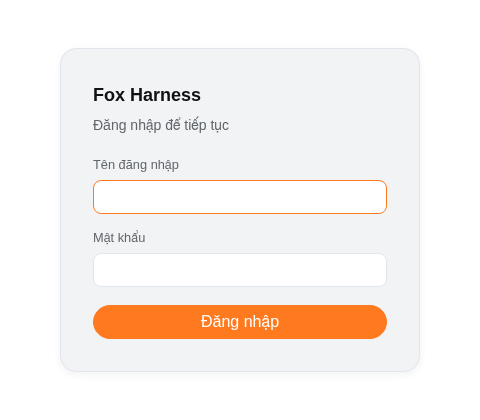

### 1.2 Đổi mật khẩu

Bấm **Admin** ở góc dưới trái → **Cài đặt**.

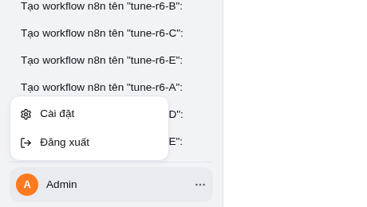

Trong tab **Tài khoản**, nhập mật khẩu mới rồi bấm **Lưu mật khẩu mới**. Nút **Đăng xuất** cũng ở đây.

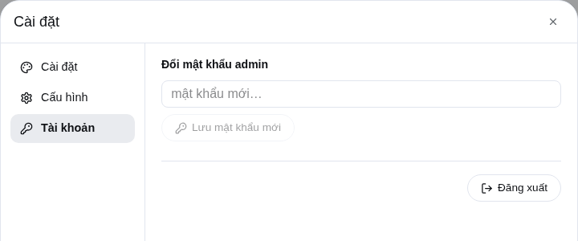

## 2. Trò chuyện

### 2.1 Gửi yêu cầu

Gõ vào ô **Nhắn cho agent…** rồi bấm **Gửi**. Hãy mô tả việc bằng lời thường; agent tự chọn công cụ phù hợp.

Mỗi thao tác hiện thành một dòng nhỏ, ví dụ `Đã dùng n8n_list_credentials`; bấm vào đó để xem chi tiết. File agent tạo hoặc tải về nằm ở thanh **Tệp trong thư mục làm việc**, ngay trên ô nhập.

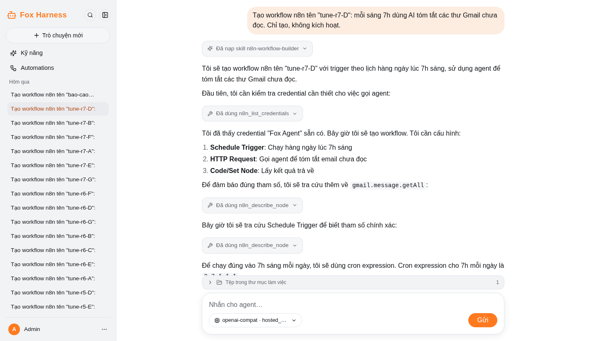

### 2.2 Đổi tên hoặc xoá cuộc trò chuyện

Rê chuột vào một dòng ở thanh bên → bấm **…** → **Đổi tên** hoặc **Xoá**. Bấm **Trò chuyện mới** để mở một cuộc trò chuyện khác.

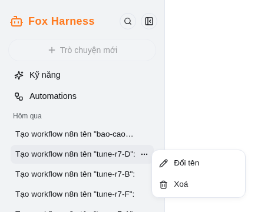

## 3. Đổi model

### 3.1 Chọn model cho cuộc trò chuyện

Bấm nút model cạnh ô nhập, bên trái nút **Gửi**, rồi chọn model.

- **Tự triển khai (mặc định)**: model đã có trên hệ thống.
- **ZAI**: các model GLM.
- **OpenRouter**: Claude, GPT và các model khác.

Thay đổi chỉ áp dụng cho cuộc trò chuyện đang mở.

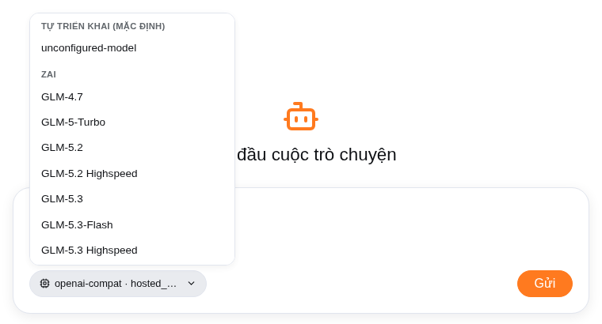

### 3.2 Dán key cho Z.ai hoặc OpenRouter

Vào **Admin → Cài đặt → Cấu hình**, dán key rồi bấm **Lưu**. Key có thể lấy tại [z.ai](https://z.ai) hoặc [OpenRouter](https://openrouter.ai/keys). Nếu chưa có key, app sẽ mở phần cấu hình khi bạn chọn model đó.

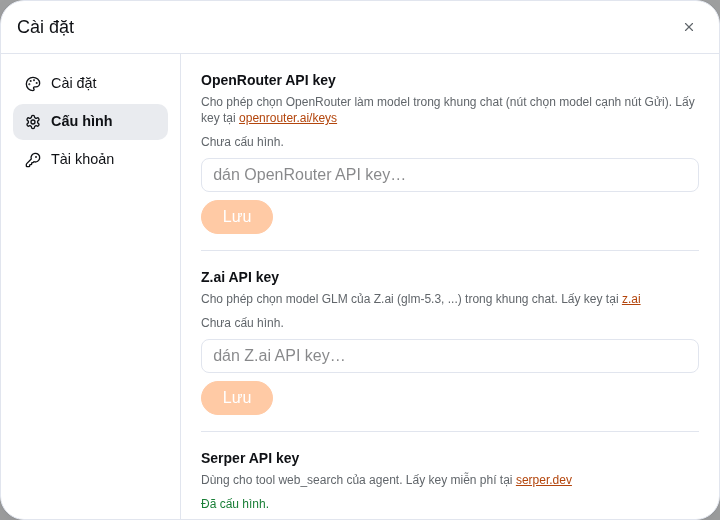

## 4. Skill

Skill là một bộ hướng dẫn để agent làm một loại việc theo đúng cách của bạn.

### 4.1 Gọi skill

Gõ `/` trong ô chat → chọn skill → viết tiếp yêu cầu. Skill bạn tự tạo có nhãn **của tôi**.

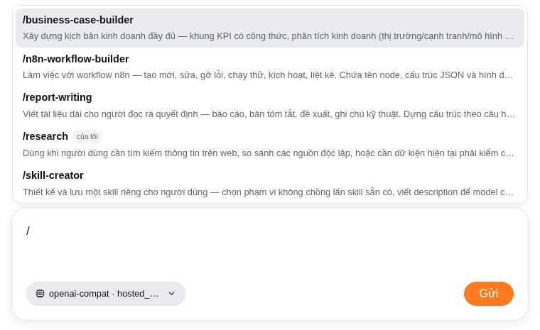

### 4.2 Xem, sửa hoặc xoá skill

Bấm **Kỹ năng** ở thanh bên.

- **Skill của tôi**: sửa và xoá được.
- **Skill có sẵn**: chỉ xem được.

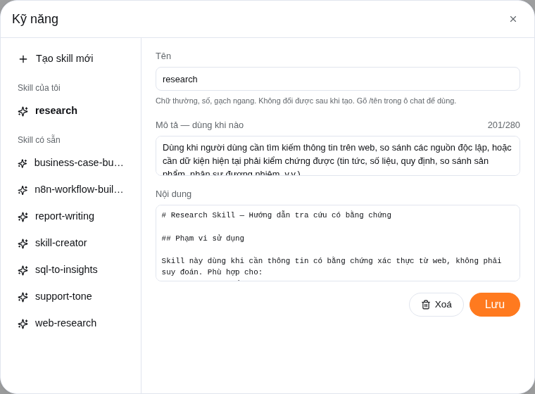

### 4.3 Tạo skill mới

Vào **Kỹ năng → Tạo skill mới**, sau đó điền:

- **Tên**: chữ thường và dấu gạch ngang, ví dụ `bao-cao-tuan`.
- **Mô tả**: khi nào dùng skill này.
- **Nội dung**: hướng dẫn chi tiết cho agent.

Bạn cũng có thể nói trong chat: “Tạo cho tôi skill viết báo cáo tuần…”. Agent sẽ gửi bản nháp để bạn duyệt trước khi lưu.

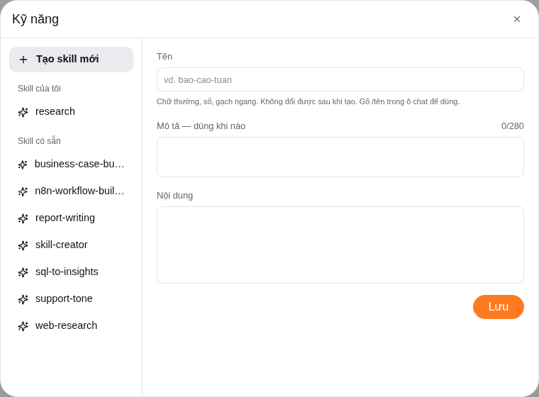

## 5. Gmail

Agent dùng Gmail qua một trình duyệt thật và bạn có thể theo dõi thao tác của nó.

### 5.1 Mở trình duyệt của agent

Vào `http://127.0.0.1:6080/vnc.html` rồi bấm **Connect**.

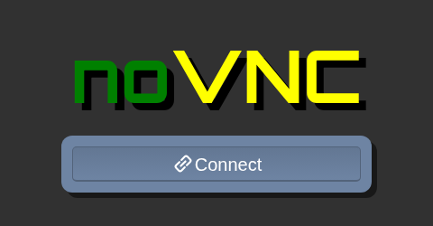

### 5.2 Đăng nhập Gmail một lần

Trong cửa sổ đó, mở `mail.google.com` và đăng nhập như bình thường. Khi thấy hộp thư, lần sau thường không cần đăng nhập lại.

> Cảnh báo: ai mở được trang noVNC có thể đọc thư của bạn. Không chia sẻ địa chỉ này ra ngoài.

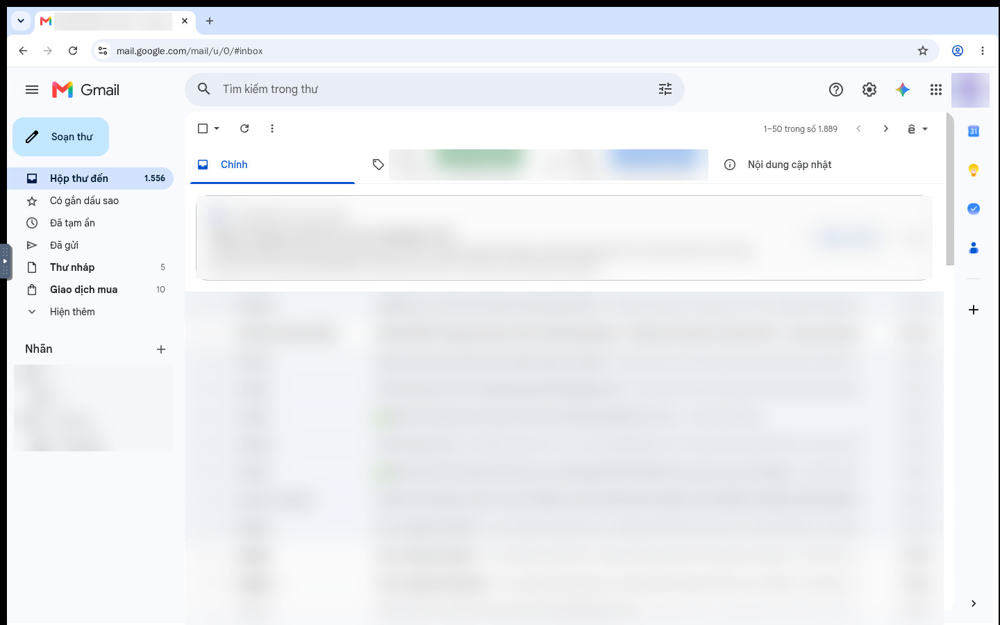

### 5.3 Nhờ agent làm việc

Ví dụ:

> Tóm tắt 5 thư chưa đọc mới nhất.

> Tìm thư có file PDF trong tuần này, tải về và tóm tắt.

> Gửi thư cho an@congty.vn, tiêu đề “Họp thứ 2”, nội dung …

Trước khi **gửi, trả lời hoặc xoá** thư, agent sẽ yêu cầu bạn xác nhận. Khi agent đang làm việc, không bấm vào cửa sổ noVNC vì có thể làm gián đoạn thao tác. Mỗi lần chỉ nên có một cuộc trò chuyện dùng Gmail.

## 6. Tự động hoá với n8n

Bạn có thể nhờ agent dựng workflow, ví dụ: mỗi sáng tóm tắt thư mới.

### 6.1 Chuẩn bị một lần

1. Mở `http://127.0.0.1:5678` và đăng nhập tài khoản n8n đã được cấp. Không ghi hoặc chia sẻ mật khẩu trong chat, tài liệu hay workflow.
2. Trong n8n, vào **Settings → n8n API** và tạo API key.
3. Trong Fox Harness, vào **Cài đặt → Cấu hình**:
   - Dán key vào ô **n8n API key**.
   - Tự đặt một chuỗi bí mật vào ô **n8n webhook secret**.

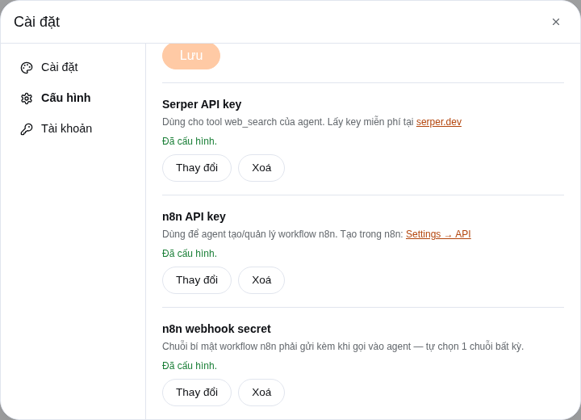

### 6.2 Kiểm tra credential `Fox Agent`

Vào **Credentials** trong n8n. Nếu đã có **Fox Agent** kiểu **Header Auth**, hãy mở nó để kiểm tra; chỉ tạo mới khi chưa có để tránh trùng.

Nếu phải tạo mới: **Credentials → Create credential → Header Auth**.

| Trường | Giá trị |
| --- | --- |
| Tên | `Fox Agent` |
| Name | `x-n8n-webhook-secret` |
| Value | Chuỗi bí mật bạn đã đặt ở bước trên |

> Giá trị **Value** là bí mật. Không chụp rõ, không gửi qua chat và không dán vào hướng dẫn.

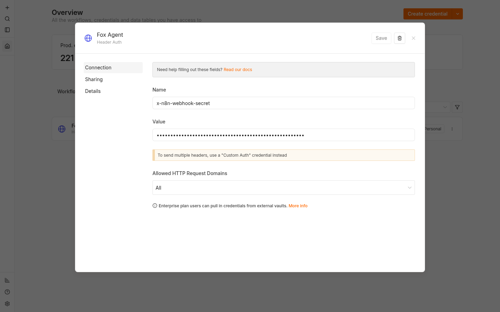

### 6.3 Nhờ agent dựng workflow

Ví dụ:

> Tạo workflow `tom-tat-sang`: mỗi sáng 7h tóm tắt thư Gmail chưa đọc.

Luồng sẽ là: **7h sáng → Agent đọc Gmail và tóm tắt → Kết quả**.

- Workflow do agent tạo luôn ở trạng thái **tắt**.
- Muốn bật, nói “kích hoạt workflow tom-tat-sang”, sau đó xác nhận trong chat.
- Muốn sửa, nói tiếp trong cùng cuộc trò chuyện, ví dụ “đổi sang 8h”.
- Mỗi lần workflow gọi agent sẽ tạo chat mới tên *Automated request from n8n* để bạn kiểm tra.

### 6.4 Xem workflow

Bấm **Automations** ở thanh bên.

- **đang bật / đang tắt**: trạng thái workflow.
- Bấm một workflow để xem các lần chạy gần đây.
- **Mở trong n8n**: mở chi tiết workflow trên n8n.

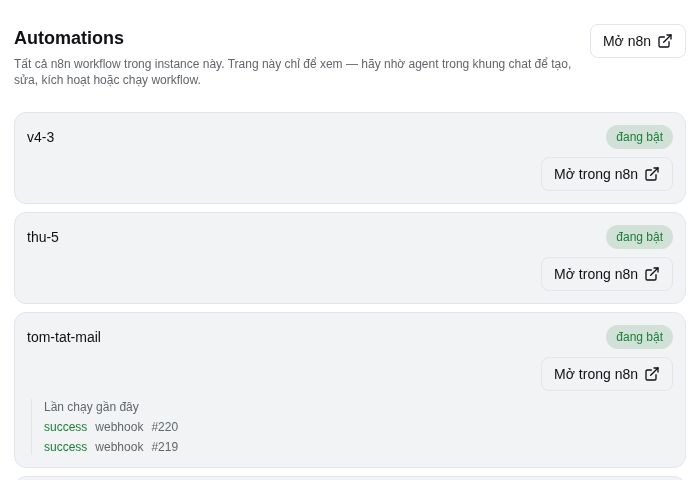

### 6.5 Workflow trong n8n

Bước gọi agent là node **HTTP Request** dùng credential **Fox Agent**. Workflow mẫu nhận trigger, gọi Fox Agent rồi trả kết quả; thông thường agent sẽ tự điền phần này.

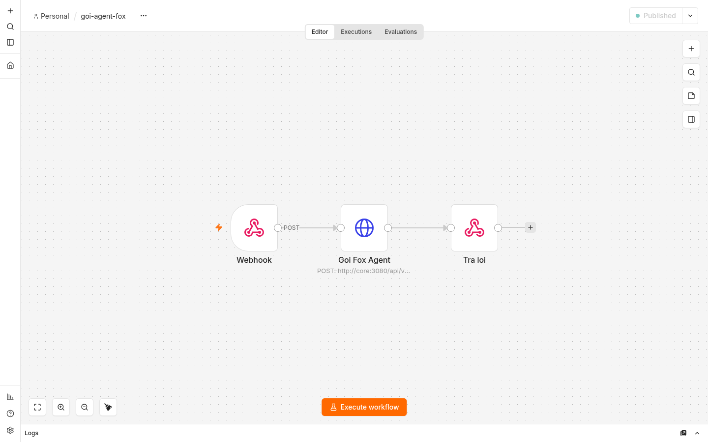

## 7. Tự code agent dành cho người tự host

Bạn có source code đầy đủ. Hãy xem n8n là bộ hẹn giờ/đường ống, còn Fox Agent là phần hiểu yêu cầu, suy nghĩ và dùng công cụ.

### 7.1 Hai luồng phối hợp với nhau

```text
n8n: đúng giờ hoặc có sự kiện
  → Fox Agent: hiểu việc cần làm
  → công cụ: Gmail, web, file, code
  → trả kết quả về n8n hoặc chat
```

| Phần | Dễ hiểu là | Nên dùng khi |
| --- | --- | --- |
| **n8n** | Người điều phối theo quy tắc cố định. | Hẹn giờ, gọi API đã biết, rẽ nhánh theo dữ liệu, lưu kết quả. |
| **Fox Agent** | Người thực hiện biết đọc ngữ cảnh và tự chọn công cụ. | Tóm tắt, soạn nội dung, đọc Gmail/tài liệu, tìm web, phân tích hoặc làm việc với file/code. |
| **Code trong source** | Các “bộ phận” tạo nên Fox Agent. | Đổi hành vi lâu dài, thêm công cụ, thay giao diện hoặc nối dịch vụ riêng. |

Ví dụ: n8n đánh thức agent lúc 7 giờ; agent đọc thư chưa đọc và viết tóm tắt; n8n nhận kết quả để gửi tiếp hoặc lưu lại. Không cần đặt cả Gmail node lẫn Fox Agent làm cùng một việc.

### 7.2 “Vibe coding” nằm ở đâu?

Không có nút riêng tên *Vibe coding*. Đây là cách mô tả kết quả mong muốn bằng lời thường trong **khung chat**, rồi agent tạo hoặc sửa file trong **Tệp trong thư mục làm việc**.

Ví dụ:

> Tạo một trang báo giá đơn giản, màu cam, có nút tải PDF; dùng dữ liệu mẫu này…

> Đọc file Excel này, tạo báo cáo tuần và lưu thành file Word để tôi duyệt.

Hãy nêu rõ mục tiêu, người dùng, ví dụ dữ liệu, giao diện/kết quả mong muốn và tiêu chí xong. Bạn xem file agent tạo rồi nói tiếp: “đổi màu”, “thêm cột”, “làm giống mẫu này”.

> Thư mục làm việc của cuộc chat không tự động là source code đang host Fox Harness. Muốn agent sửa chính dự án này qua chat, người quản trị phải đặt/cho phép repo đó trong workspace phù hợp. Bình thường, hãy tự sửa source bằng editor rồi build lại.

### 7.3 Bản đồ source: muốn sửa gì thì mở đâu?

| Muốn thay đổi | Chỗ bắt đầu | Ghi nhớ |
| --- | --- | --- |
| Tính cách, quy tắc trả lời, cách agent làm việc | `packages/bundle-core/src/prompt.ts` | “Não hướng dẫn” của agent. Sửa nhỏ, rõ ràng; không bỏ quy tắc an toàn/xác thực nếu chưa hiểu hậu quả. |
| API, chat, approval, file trong workspace | `packages/bundle-core/src/gateway.ts` | Cầu nối giữa giao diện và phiên chạy agent. |
| Đăng nhập, giao diện, sidebar, chat, Automations | `apps/web/` | `app/page.tsx` ghép màn hình; các thành phần nằm ở `components/features/`. |
| Thêm tool riêng như CRM/ERP | `packages/tool/<ten-cong-cu>/src/index.ts` | Xem `packages/tool/create-skill/` làm mẫu. Tool cần đăng ký vào composition. |
| n8n gọi agent hoặc agent quản lý workflow | `packages/tool/n8n/src/index.ts` | Cầu nối n8n ↔ agent; secret chỉ ở credential. |
| Model tự host / OpenAI-compatible | `packages/llm/openai-compat/` | Adapter giao tiếp model; không hard-code API key. |
| Quy trình lặp lại không cần code | **Kỹ năng** trong app hoặc `packages/skills/` | Skill của tôi sửa trên giao diện; skill đóng gói cần build lại. |

### 7.4 Ba cách tuỳ chỉnh

1. **Không code:** tạo/sửa **Skill** để agent theo mẫu báo cáo, quy trình và giọng văn của bạn.
2. **Chỉnh luồng n8n:** vào **Automations → Mở trong n8n**, đổi lịch chạy hoặc bước cơ học. Hãy test thủ công trước và giữ workflow tắt đến khi duyệt.
3. **Sửa source:** tạo nhánh hoặc sao lưu, sửa một module, kiểm tra rồi mới đưa vào dùng.

Quy trình an toàn khi sửa source:

```bash
pnpm run typecheck
pnpm run build
```

Sau đó khởi động lại. Khi chạy Docker, dùng:

```bash
./scripts/start.sh
```

Cấu hình triển khai lâu dài ở `data/harness/profiles/cordis-app/cordis.patch.yml` sau lần chạy Docker đầu tiên. Sửa file đó rồi chạy:

```bash
docker compose -f deploy/docker-compose.yml restart core
```

Không đặt API key hoặc password trong file patch; dùng **Cài đặt → Cấu hình**.

### 7.5 Công thức thêm tool riêng

Ví dụ cần cho agent tra cứu CRM nội bộ:

1. Tạo package dưới `packages/tool/<ten-cong-cu>/`; xem `packages/tool/create-skill/` làm ví dụ nhỏ.
2. Trong `src/index.ts`, khai báo tên tool, dữ liệu vào, dữ liệu ra và code gọi CRM.
3. Đăng ký package trong `deploy/entrypoint.sh` và composition để agent thấy tool khi khởi động.
4. Đặt API key trong credential/config, không hard-code vào TypeScript; chạy typecheck và build.

> Không sửa trực tiếp `node_modules/` hoặc dữ liệu phiên/credential trong `data/harness/` để thêm tính năng. Ngoại lệ có chủ đích là `data/harness/profiles/cordis-app/cordis.patch.yml` để cấu hình deployment. n8n là tool tuỳ chọn; xem hướng dẫn bật/tắt chi tiết tại `docs/patch-cookbook.md`.

### 7.6 Khi nào cần người có kỹ thuật?

Bạn có thể tự làm Skill, đổi lịch n8n và yêu cầu agent tạo file/code. Hãy nhờ người có kỹ thuật khi thêm service có API/credential mới, đổi quyền truy cập file, sửa `cordis.patch.yml`, hoặc đưa app ra Internet. Các thay đổi này có thể ảnh hưởng bảo mật và toàn bộ người dùng.

## 8. Hỏi đáp nhanh

### Agent báo không có thư dù hộp thư có thư

Có thể phiên Gmail hết hạn. Mở `127.0.0.1:6080`; nếu thấy trang đăng nhập Google thì đăng nhập lại. Nếu không, hỏi lại agent một lần.

### Cửa sổ Gmail bị trắng hoặc báo lỗi

Agent tự mở tab mới và làm tiếp. Nếu vẫn lỗi, nhờ quản trị viên khởi động lại dịch vụ trình duyệt; bạn thường không phải đăng nhập lại.

### Agent báo không chắc thư đã gửi

Trình duyệt có thể bị gián đoạn khi gửi. Kiểm tra thư mục **Đã gửi** trước khi nhờ agent gửi lại.

### Xoá trò chuyện báo `session is still live`

Cuộc trò chuyện đang chạy, thường do n8n gọi. Chờ vài phút rồi xoá lại.

### Chọn model Z.ai hoặc OpenRouter báo lỗi

Chưa dán key. Vào **Cài đặt → Cấu hình**, dán key rồi chọn lại model.

### Lưu key trong Cấu hình báo lỗi

Key có thể đã được người quản trị đặt sẵn trong cấu hình máy chủ; bạn không cần làm thêm.

### Agent đứng im, không trả lời

Kéo xuống cuối khung chat xem có hộp nào đang chờ bạn đồng ý không. Nếu không có, bấm nút dừng rồi gửi lại.

### Tab Automations báo lỗi

Kiểm tra đã dán **n8n API key** trong **Cài đặt → Cấu hình** chưa.
